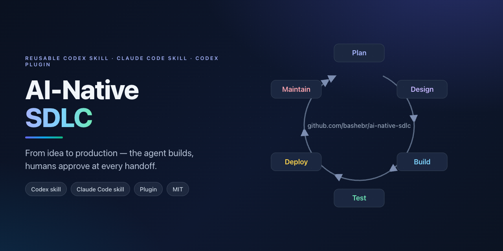

# AI-Native SDLC — reusable workflow repo



A ready-to-inherit implementation of Anthropic's [AI-Native SDLC playbook](https://claude.com/blog/the-ai-native-sdlc-playbook): give your coding agent a task link from Linear, GitLab, or GitHub, and it drives the work through design, build, and review to an opened MR/PR — with human approval gates at every handoff.

> **Where this fork stops: the loop ends when the MR/PR is opened.** The agent never merges, deploys, or releases — the team reviews and merges, and deployment is the team's own pipeline. The upstream playbook's Test, Deploy, and Maintain phases (evals, release gate, monitoring) are kept only as optional extras; they are not scaffolded and not part of the default flow.

This repo is three things at once:

- A **Codex skill** at `skills/ai-native-sdlc/`, installable into `~/.codex/skills`.
- A **Claude Code skill** — the same folder, installable into `~/.claude/skills`.
- A **Codex plugin** (`.codex-plugin/plugin.json` at the repo root) that bundles the skill, so teams can publish or fork it as their workflow baseline.

**Learn more:** [Phase-by-phase playbook](skills/ai-native-sdlc/references/playbook.md) · [Staged adoption guide](skills/ai-native-sdlc/references/adoption.md) · [Workflow as a directed graph](skills/ai-native-sdlc/references/graph.md) · [Agent org](skills/ai-native-sdlc/references/org.md) · [Worked example](examples/expense-tracker/)

## What this is about

Writing code is no longer the bottleneck — agents produce it in hours. The bottleneck moved to the process around the code: planning, review, deployment, and governance still run at human speed and human scale. This repo reworks the SDLC so those stages keep up with the build. The upstream loop is Plan → Design → Build → Test → Deploy → Maintain; this fork runs its first half — Plan (the tracker board) → Design → Build → Review — and stops at the opened MR/PR. Every stage ends by committing a versioned artifact the next stage reads, human judgment concentrates at gates instead of line-by-line review, and guardrails run as deterministic hooks rather than habits. The operating principle, in one sentence: the agent does everything up to the opened MR/PR, and nothing after it.

## Graph engineering

The loop is a directed graph, not a linear pipeline. Plays and artifacts are nodes, gates are human approval points, and triggers are the edges that fire the next stage: a task on the board fires Design, an approved spec fires plan mode, and an approved plan fires the build that ends at the opened MR/PR. Treating the workflow as a graph makes it automatable, parallelizable (independent branches run in separate worktrees), and auditable (node history is the record). The plays also form a separate adoption graph — start at the leaf plays (capture intent, CLAUDE.md, feedback loop, hooks, plan mode) and build outward. The machine-readable form is `skills/ai-native-sdlc/assets/workflow-graph.example.yaml`; full detail in `skills/ai-native-sdlc/references/graph.md`.

## The workflow

```
Plan (tracker board) → Design → Build → Review → MR/PR opened ■ end
                                                   │
                        team review, merge, deploy: outside this workflow
```

Each phase ends by committing a versioned artifact; the next phase starts by
reading it. The full phase → artifact → gate contract lives in
`skills/ai-native-sdlc/SKILL.md` (single source of truth). The short version:
**Plan** is the tracker: a task on the Linear/GitLab/GitHub board is an
accepted intent (no `intent.md` in the repo). **Design** commits `spec.md`,
**Build** commits `plan.md` then code + tests, **Review** runs the REVIEW.md
passes and verification, then opens the MR/PR — the last thing the agent does.

The agent does the generation, verification, and mechanical work. Humans keep the judgment calls: approving the spec and the plan, the go-ahead to open the MR/PR, and the review and merge that follow it.

**Framework mapping.** The skill is framework-neutral: Claude Code calls repository memory CLAUDE.md and keeps skills in `.claude/skills/`; Codex calls it AGENTS.md and installs skills into `~/.codex/skills/`. The templates, artifacts, and scaffold script are the same either way.

## Install

### As a Codex skill

```bash
mkdir -p ~/.codex/skills
cp -R skills/ai-native-sdlc ~/.codex/skills/
```

### As a Claude Code skill

```bash
mkdir -p ~/.claude/skills
cp -R skills/ai-native-sdlc ~/.claude/skills/
```

### As a Codex plugin

Clone or copy this repo to `~/plugins/ai-native-sdlc`, then add it to your personal marketplace at `~/.agents/plugins/marketplace.json`:

```json
{
  "name": "personal",
  "interface": {
    "displayName": "Personal"
  },
  "plugins": [
    {
      "name": "ai-native-sdlc",
      "source": {
        "source": "local",
        "path": "./plugins/ai-native-sdlc"
      },
      "policy": {
        "installation": "AVAILABLE",
        "authentication": "ON_INSTALL"
      },
      "category": "Productivity"
    }
  ]
}
```

For a team, publish the repo and point a marketplace at it instead.

Installing the plugin also makes the bundled skill available, so you don't need to also copy it into `~/.codex/skills` — choose one path.

### Or inherit the repo directly

Fork it, keep the skill and templates, and drop in your organization's standards. The repo models the workflow it ships, so agents working inside it (via the root `AGENTS.md`) follow the same conventions.

## Use it

Start a new project:

```bash
python3 skills/ai-native-sdlc/scripts/init_workflow.py my-project --name "My idea"
```

Then tell your agent:

> $ai-native-sdlc: run the workflow for https://linear.app/acme/issue/ENG-123

Run it from the repo the task belongs to. The agent resolves the link (`scripts/tracker_link.py`, no config — self-hosted GitLab is recognized by its `/-/` link shape), reads the task — it never edits it — and starts at Design. From there it moves through spec → plan → build → review, stopping at each approval gate, and opens the MR/PR — where it stops. The MR/PR closes the task when the team merges it. Authentication stays with the tracker's own MCP connector or CLI (`glab`, `gh`); see `skills/ai-native-sdlc/references/trackers.md`.

No task yet? Describe the idea; the agent interviews you, drafts the task description, and creates it in the tracker once you confirm.

### Set up an existing repo

Nothing from this repo is copied into yours for the task-link flow: the skill
and `tracker_link.py` run from the installed skill.

1. **Install the skill** (see [Install](#install)).
2. **Authenticate the tracker** with its own tool — the skill holds no
   credentials:
   - GitLab: `glab auth login --hostname <your-gitlab-host>` (or a GitLab MCP
     connector)
   - Linear: connect the Linear MCP connector
   - GitHub: `gh auth login`
3. **Add the optional sections** to the repo's `CLAUDE.md` (`AGENTS.md` in
   Codex) — only the ones that apply. Keep them to pointers; never paste the
   knowledge itself:

   ```markdown
   ## Tracker

   - Issues live in `group/backlog`, not in this project; MRs reference them as
     `group/backlog#N`.

   ## Knowledge base

   - `docs/kb/` — decisions in `docs/kb/decisions/`, glossary in `docs/kb/glossary.md`
   - MCP `<server-name>` — search by service name or domain term

   ## Commit and MR/PR

   - Commit with the `/commit` skill; open MRs with the `/create-mr` skill.
   - MR template: `.gitlab/merge_request_templates/default.md`
   ```

   | Section | Without it | Add it when |
   |---|---|---|
   | `## Tracker` | the repo is the current checkout; the forge comes from `git remote get-url origin` (`gh` + PRs, `glab` + MRs) | tasks live somewhere the link and remote don't reveal (another project, another tracker) |
   | `## Knowledge base` | Design skips the knowledge search | the project has a knowledge base (repo folder or MCP store); Design reads it before writing `spec.md` |
   | `## Commit and MR/PR` | commits follow the repo's `git log` style and cite the task; the MR/PR body comes from the repo's template (else the skill's) with the closing keyword | the project has its own commit or MR/PR skills, a template elsewhere, or title/body rules |

   Many repos sharing the same setup? Claude Code also reads `CLAUDE.md` from
   parent directories, so one file in the folder that holds them (for example
   `~/work/<company>/CLAUDE.md`) covers every repo below it. Codex needs the
   sections in each repo's `AGENTS.md`.
4. **Run it from the repo:** `/ai-native-sdlc <task link>` in Claude Code, or
   `$ai-native-sdlc: run the workflow for <task link>` in Codex.

Want the gate ledger and plan-sync check too? Scaffold them — existing
files, including your `CLAUDE.md`, are skipped unless you pass `--force`
(nothing for deploy, monitoring, or evals is scaffolded):

```bash
python3 skills/ai-native-sdlc/scripts/init_workflow.py path/to/your-repo
```

## Autonomous agent org

For teams that want the loop to run with less human steering, the skill can
scaffold an **agent org** into any project — named roles with an org chart,
peer review of every artifact, and multi-channel demand intake:

```bash
python3 skills/ai-native-sdlc/scripts/init_org.py my-project
```

The default org: **CEO (you, human)** → **CTO (agent)** → product manager,
product engineering agent, engineers, and reviewer. Agents run the phases,
review each other's work (reviewers accept only when idle), and report up the
chain; the human CEO is involved at the critical points — intent ambiguity,
unresolved spec/plan disagreement, and MR/PR merge. Demand enters
through GitHub issues (`scripts/sync_issues.py pull`), app feedback forms, and
email, all landing as versioned records in `org/intake/` that the product
engineering agent turns into tickets and intents.

Org bookkeeping is command-driven: `scripts/org_status.py` keeps agent
busy/idle state and the review queue valid against `org/org-chart.yaml`, and
`scripts/intake.py add|list` normalizes form/email demand into the same intake
format GitHub issues use.

See `skills/ai-native-sdlc/references/org.md` for the full protocol.

## Examples

The `examples/` folder contains a worked project — the expense-tracker idea
from this README. It shows what `intent.md`, `spec.md`, `plan.md`, `CLAUDE.md`,
and the workflow graph look like when filled in, and it is also a real static
app (`index.html`, `app.js`, `style.css`) with expenses persisted in the
browser. **Live demo:** [bashebr.github.io/ai-native-sdlc](https://bashebr.github.io/ai-native-sdlc/)
— hosted on GitHub Pages from the repo's `gh-pages` branch. The folder also
opens locally (`index.html`) and is Vercel-ready via `vercel.json`. Use the
example as reference for tone and structure, then scaffold your own blanks
with the script above.

## Customizing for your organization

- **Standards as skills** — encode brand, security, UX, and compliance policies as skills so Design and Build apply them consistently.
- **Hooks as red lines** — protected paths and secrets go in deterministic hooks, not prose; `hook-settings.example.json` shows the wiring.
- **Review culture** — `REVIEW.md` sets the passes (bugs, security, compliance), the evidence requirement, and the 5-nit cap.
- **Commit and MR/PR** — point the workflow at the project's own commit and MR/PR skills in the `## Commit and MR/PR` section.

Optional extras, outside the loop (kept from the upstream playbook, not scaffolded):

- **Release gate** — `production-gate.sh` blocks deploys without human authorization; `managed-settings.example.json` is the regulated-enterprise starting point.
- **Evals** — `run_evals.py` + `agent-evals.yml.example` run a suite of real tasks in CI.
- **Monitoring** — `bands.yaml` + `detect_bands.py` define control bands; `incident.md` and `runbooks/` cover the response.

See `skills/ai-native-sdlc/references/adoption.md` for the staged rollout order.

## Layout

```text
.
├── .codex-plugin/plugin.json      # Codex plugin manifest (repo root is the plugin)
├── .github/workflows/self-check.yml  # CI for this repo itself (validate + tests)
├── AGENTS.md                      # guidance for agents working in this repo
├── README.md
├── CHANGELOG.md
├── LICENSE
├── SECURITY.md
├── examples/
│   ├── README.md
│   └── expense-tracker/           # worked example + real static app (Vercel-ready)
├── tests/                         # gate, scaffold, band-detector, eval-runner tests
└── skills/
    └── ai-native-sdlc/
        ├── SKILL.md               # skill entrypoint (versioned; rule→enforcement matrix)
        ├── agents/openai.yaml     # UI metadata
        ├── references/
        │   ├── playbook.md        # phase-by-phase procedures
        │   ├── adoption.md        # staged rollout + org customization
        │   ├── graph.md           # the loop as a directed graph
        │   ├── org.md             # autonomous agent org (roles, review, intake)
        │   └── trackers.md        # intent from Linear/GitLab/GitHub task links
        ├── assets/                # templates copied into target projects
        │   ├── intent.md          # shape of a new tracker task (not copied)
        │   ├── spec.md
        │   ├── plan.md
        │   ├── CLAUDE.md
        │   ├── REVIEW.md
        │   ├── bands.yaml         # optional extra (monitoring)
        │   ├── production-gate.sh # optional extra (release gate)
        │   ├── org/               # agent org templates (chart, roles, protocol)
        │   ├── evals.example.md
        │   ├── evals.example.json
        │   ├── evals-README.md
        │   ├── workflow-graph.example.yaml
        │   ├── workflow-graph.yaml
        │   ├── incident.md
        │   ├── runbooks/          # rollback-deploy.md, README.md
        │   ├── PULL_REQUEST_TEMPLATE.md
        │   ├── gates-README.md
        │   ├── hook-settings.example.json
        │   ├── agent-evals.yml.example
        │   └── managed-settings.example.json
        └── scripts/
            ├── init_workflow.py   # scaffolds the artifact skeleton
            ├── init_org.py        # scaffolds the autonomous agent org
            ├── sync_issues.py     # GitHub issue intake (pull/push)
            ├── quick_validate.py  # skill/plugin self-check
            ├── run_evals.py       # eval-suite runner (Phase 4)
            ├── detect_bands.py    # control-band detection (Phase 6)
            ├── gate_ledger.py     # hash-chained approval ledger (all gates)
            ├── workflow_state.py  # graph state runtime (status/advance/check)
            ├── check_plan_sync.py # deterministic plan-sync enforcement
            ├── org_status.py      # agent busy/idle + review queue
            └── intake.py          # form/email demand intake
```

## Contributing

Contributions are welcome — this repo practices what it ships. Open an issue
first for larger ideas (new phases, changed artifacts, redesigns); for fixes
and small improvements, fork, branch, and open a pull request.

### Getting started

1. Fork the repo and clone your fork.
2. Create a branch: `git checkout -b my-change`.
3. Make your change, then run the self-check suite from the repo root:

   ```bash
   python3 skills/ai-native-sdlc/scripts/quick_validate.py skills/ai-native-sdlc
   bash tests/test_gate.sh
   bash tests/test_init.sh
   python3 -m unittest discover -s tests -v
   ```

   All checks must pass before opening the PR — CI runs the same checks on
   every pull request (`.github/workflows/self-check.yml`).
4. Add a `CHANGELOG.md` entry under `[Unreleased]` for user-visible changes.
5. Commit with a clear message and open the pull request.

### Conventions

- Templates in `skills/ai-native-sdlc/assets/` are copied into target
  projects — never edit them to fit one project; change
  `scripts/init_workflow.py` when the scaffold layout changes.
- Keep `SKILL.md` short; put phase detail in `references/`.
- Keep artifacts generic — organization specifics belong in the adopter's own
  skills and hooks, never in shared templates.
- Keep `plugin.json` and the SKILL.md frontmatter `version` in sync (semver);
  `quick_validate.py` enforces this.
- Follow the existing commit style: `feat:`, `fix:`, `docs:`, `chore:`, `test:`.

### Reporting vulnerabilities

Security-sensitive bugs (release-gate bypasses, hook failures,
managed-settings weaknesses) should not be filed as public issues. See
`SECURITY.md` for how to report them privately.

By contributing, you agree your contributions are licensed under the MIT
license (see `LICENSE`).

## Attribution and license

Based on [The AI-Native SDLC playbook](https://claude.com/blog/the-ai-native-sdlc-playbook) by Anthropic's Applied AI team (2026). MIT licensed — see `LICENSE`.
